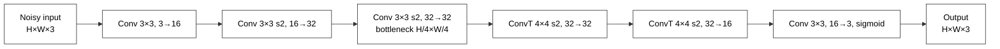

# Image Denoising with Julia and Flux.jl

**Course:** 241-353 AI Ecosystem, Prince of Songkla University (PSU)
**Session:** Workshop lecture, September 2026

Workshop material that introduces the Julia and Flux.jl ecosystem by building a compact convolutional network that removes noise from images.
All training data is synthesized from a single image (`image.png`), so no dataset download is needed. The model has about 27k parameters and trains on a laptop CPU in a few minutes.


*Left to right: noisy input (Gaussian σ = 0.15 plus 10 % random-valued impulse noise), network output, clean reference.*

## Workshop overview

**Objective.** Participants learn how a complete deep-learning workflow is written in Julia: data synthesis, model definition, automatic differentiation, training, persistence and inference. The case study is image denoising.

**Intended audience.** Students with basic programming experience and a general understanding of neural networks. No prior Julia knowledge is assumed.

**Learning outcomes.** By the end of the workshop, participants will be able to:
- Represent images as `Float32` WHCN tensors and synthesize supervised training pairs
- Define convolutional networks with `Chain`, `Conv`, `ConvTranspose` and `SkipConnection`
- Compute gradients with Zygote (and Enzyme), and train with `Flux.setup` and `Flux.update!`
- Save and restore models with `Flux.state` and `Flux.loadmodel!`
- Run memory-bounded inference on images of any size, and evaluate the results quantitatively

**Suggested agenda (about 3 hours).**

| Session | Notebook | Duration |
|---|---|---|
| 1. Julia and Flux essentials | 01 | 45 min |
| 2. Data synthesis and architecture design | 02, sections 1–3 | 45 min |
| 3. Training and evaluation | 02, sections 4–6 | 40 min |
| 4. Inference, tiling and limitations | 03 | 40 min |
| Discussion and exercises | all | 10 min |

Training both models takes about 4 minutes on a single CPU thread and less with multithreading. It can run during the architecture discussion.

## Contents

| Notebook | Scope |
|---|---|
| [01_julia_flux_basics.ipynb](01_julia_flux_basics.ipynb) | Julia essentials (Float32, WHCN arrays, broadcasting, callable structs, JIT); Flux layers, Zygote vs Enzyme, training loop, conv layers, `SkipConnection`, custom layers, saving |
| [02_denoise_training.ipynb](02_denoise_training.ipynb) | Patch sampling and augmentation, noise synthesis, baseline autoencoder vs residual CNN denoiser, training, evaluation, saving the model |
| [03_denoise_inference.ipynb](03_denoise_inference.ipynb) | Loading the model, denoising, comparison with Gaussian blur and median filters, noise-level sweeps, full-resolution tiled inference, out-of-distribution test |

Run the notebooks in order. Notebook 3 needs `denoiser.jld2`, which notebook 2 writes.

## Requirements

- Julia 1.13 (tested with 1.13.0)
- Jupyter with the IJulia kernel, or VS Code with the Jupyter extension
- About 2 GB of free RAM; no GPU required

## Setup

```bash
git clone https://github.com/rwttr/Eco-workshop-n8.git
cd Eco-workshop-n8
julia --project=. -e 'using Pkg; Pkg.instantiate()'

# Register the Jupyter kernel if needed (once per machine)
julia --project=. -e 'using IJulia; IJulia.installkernel("Julia", "--project=@.")'
```

Then open the notebooks in Jupyter or VS Code and select the Julia kernel.

**Multithreading (recommended).** Conv layers run faster with several threads. Register a threaded kernel:

```julia
using IJulia
IJulia.installkernel("Julia (threads)", "--project=@."; env = Dict("JULIA_NUM_THREADS" => "auto"))
```

**Markdown font size.** `.vscode/settings.json` sets `notebook.markup.fontSize` so markdown cells match the code-cell font size in VS Code.

## Packages

| Package | Role |
|---|---|
| Flux.jl | Layers, optimisers, training utilities |
| Zygote.jl | Automatic differentiation (default backend) |
| Enzyme.jl | Alternative AD backend (compared in notebook 1) |
| Optimisers.jl / MLUtils.jl | Optimiser rules, `DataLoader` (used through Flux) |
| Images.jl, FileIO.jl, ImageIO.jl | Image loading, resizing, filtering, display |
| JLD2.jl | Saving and loading model state |
| Plots.jl | Learning curves and evaluation plots |
| IJulia.jl | Jupyter kernel |

**Why Zygote?** The denoiser uses only standard Flux layers, which Zygote supports well. Zygote's first-call compile time is much shorter than Enzyme's for conv networks, which matters for interactive CPU sessions. Enzyme is recommended for code that mutates arrays or needs maximum performance. Switching backends is a one-line change: `Flux.gradient(f, Duplicated(model))`.

## Method

1. **Data synthesis.** Random 40×40 patches are cropped from `image.png` at scales 1/4, 1/3 and 1/2, with random flips and transposes. The bottom 20 % of the image is held out for validation.
2. **Noise.** Every patch receives Gaussian white noise with σ ~ U[0.05, 0.35]. Half of the patches also receive random-valued impulse noise: each pixel is replaced, with probability p ~ U[0, 0.20], by a uniformly random colour. New noise is drawn every epoch.
3. **Model.** A compact residual CNN in the style of DnCNN. It estimates the noise map n̂, and the output is `x − n̂`.
4. **Training.** MSE loss, Adam (lr = 2e-3, reduced ×1/5 for the last quarter of training), 20 epochs × 1024 patches, batch size 32.
5. **Inference.** A single forward pass works for any image size. Images larger than memory allows are processed as 256×256 tiles with a 16-pixel context margin, which exceeds the receptive-field radius, so the output is identical to a single pass.

## Evaluation metrics

**Mean squared error (MSE)** is the training loss. It is the average squared difference between the output $\hat{x}$ and the clean reference $x$ over all $N$ pixel values:

$$\mathrm{MSE}(\hat{x}, x) = \frac{1}{N}\sum_{i=1}^{N} (\hat{x}_i - x_i)^2$$

**Peak signal-to-noise ratio (PSNR)** is the reported quality metric. For images with intensities in $[0, 1]$ (peak value 1):

$$\mathrm{PSNR}(\hat{x}, x) = 10 \log_{10}\frac{1}{\mathrm{MSE}(\hat{x}, x)} \quad [\mathrm{dB}]$$

PSNR is logarithmic: each gain of 3 dB halves the MSE, and a 10 dB gain is a tenfold reduction. As a rough guide for natural images, below 20 dB is visibly degraded, 25–30 dB is good, and above 30 dB is hard to tell from the reference. PSNR measures pixel-wise fidelity and does not fully reflect perceived quality. Structural metrics such as SSIM (available as `assess_ssim` in Images.jl) are a common complement.

**Evaluation protocol.**
- *Validation (notebook 2):* 128 fixed 48×48 patches from the held-out bottom 20 % of the image, with mixed noise (Gaussian σ = 0.15 plus impulse p = 0.10) and fixed random seeds.
- *Test (notebook 3):* the image at 1/2 scale (539×600) and at full resolution (1078×1200). Two sweeps are run: Gaussian σ ∈ {0.05, …, 0.50} and impulse p ∈ {0.05, …, 0.30}. Levels above the training ranges test extrapolation.
- *Baselines:* the noisy input itself; the best Gaussian blur (σ_blur ∈ {0.5, 1, 1.5, 2}); and the best median filter (3×3 or 5×5). For each input, the setting with the highest PSNR is used, which is an upper bound for these filters.
- *Out-of-distribution test:* row-stripe noise, which is spatially correlated and absent from training.

## Network architecture

### Residual CNN denoiser (main model)


Flux structure: `SkipConnection(Chain(Conv, 5 × Conv, Conv), subtract_noise)`.

| # | Layer | Kernel / stride | Channels | Output | Receptive field | Parameters |
|---|---|---|---|---|---|---|
| 1 | Conv + ReLU | 3×3 / 1 | 3 → 24 | H×W×24 | 3×3 | 672 |
| 2 | Conv + ReLU | 3×3 / 1 | 24 → 24 | H×W×24 | 5×5 | 5,208 |
| 3 | Conv + ReLU | 3×3 / 1 | 24 → 24 | H×W×24 | 7×7 | 5,208 |
| 4 | Conv + ReLU | 3×3 / 1 | 24 → 24 | H×W×24 | 9×9 | 5,208 |
| 5 | Conv + ReLU | 3×3 / 1 | 24 → 24 | H×W×24 | 11×11 | 5,208 |
| 6 | Conv + ReLU | 3×3 / 1 | 24 → 24 | H×W×24 | 13×13 | 5,208 |
| 7 | Conv (noise estimate) | 3×3 / 1 | 24 → 3 | H×W×3 | 15×15 | 651 |
| 8 | Residual: `x − n̂` | – | 3 | H×W×3 | 15×15 | 0 |
| | **Total** | | | | | **27,363** (≈ 107 KiB) |

Design properties:
- **No downsampling.** Every layer keeps the full resolution, so fine detail is preserved and any input size is accepted without padding.
- **Residual learning.** Estimating the noise is easier than reconstructing the image. The identity path carries the image content.
- **Local context.** The 15×15 receptive field covers the pixel-level noise used here, and keeps tiled inference exact with a small margin.

### Baseline autoencoder (for comparison)



| # | Layer | Kernel / stride | Channels | Output | Parameters |
|---|---|---|---|---|---|
| 1 | Conv + ReLU | 3×3 / 1 | 3 → 16 | H×W×16 | 448 |
| 2 | Conv + ReLU | 3×3 / 2 | 16 → 32 | H/2×W/2×32 | 4,640 |
| 3 | Conv + ReLU (bottleneck) | 3×3 / 2 | 32 → 32 | H/4×W/4×32 | 9,248 |
| 4 | ConvTranspose + ReLU | 4×4 / 2 | 32 → 32 | H/2×W/2×32 | 16,416 |
| 5 | ConvTranspose + ReLU | 4×4 / 2 | 32 → 16 | H×W×16 | 8,208 |
| 6 | Conv + sigmoid | 3×3 / 1 | 16 → 3 | H×W×3 | 435 |
| | **Total** | | | | **39,395** |

The bottleneck removes noise but also removes fine detail, and the input height and width must be multiples of 4.

### Architecture selection

Candidates were compared on the same mixed-noise training data, with 30 epochs on 48×48 patches. The selected model was trained for 20 epochs on 40×40 patches, the configuration used in the notebooks. Validation PSNR is reported for Gaussian σ = 0.25 and for Gaussian σ = 0.10 plus impulse p = 0.10:

| Architecture | Parameters | σ = 0.25 | σ = 0.10 + p = 0.10 |
|---|---|---|---|
| Noisy input | – | 13.9 dB | 15.5 dB |
| U-Net (2 levels, 16/32 channels) | 53,267 | 24.1 dB | 25.5 dB |
| Dilated residual CNN (dilations 1–4, 24 channels) | 27,363 | 22.5 dB | 23.9 dB |
| **Residual CNN, 7 layers × 24 channels (selected)** | **27,363** | **24.1 dB** | **25.7 dB** |
| Residual CNN, 7 layers × 32 channels | 48,003 | 24.4 dB | 25.8 dB |

The selected model matches the U-Net with about half the parameters and a simpler structure.

## Reference results

Measured on an Apple Silicon laptop, CPU only, with one Julia thread and the default settings (20 epochs). Exact values vary slightly between runs.

**Training (notebook 2).** Validation PSNR on mixed noise (σ = 0.15, p = 0.10):

| Model | Parameters | Training time | Validation PSNR |
|---|---|---|---|
| Noisy input | – | – | 14.4 dB |
| Baseline autoencoder | 39,395 | 58 s | 22.5 dB |
| Residual CNN denoiser | 27,363 | 169 s | 24.7 dB |

**Inference (notebook 3).** Half-resolution test image (539×600); inference takes 0.4 s per image.

*Demo setting (σ = 0.15, p = 0.10):* the noisy input scores 14.3 dB, the best Gaussian blur 21.7 dB, the best median filter 24.9 dB, and the neural denoiser **26.4 dB**.

*Gaussian noise sweep:*

| σ | Noisy input | Best blur | Best median | Neural denoiser |
|---|---|---|---|---|
| 0.05 | 26.8 dB | 30.3 dB | 29.8 dB | 29.9 dB |
| 0.10 | 21.3 dB | 27.8 dB | 27.4 dB | 28.8 dB |
| 0.20 | 15.9 dB | 23.7 dB | 24.6 dB | 26.7 dB |
| 0.30 | 12.8 dB | 20.4 dB | 22.4 dB | 25.0 dB |
| 0.40 (outside training range) | 10.8 dB | 17.9 dB | 20.5 dB | 23.6 dB |
| 0.50 (outside training range) | 9.4 dB | 16.1 dB | 19.0 dB | 22.1 dB |

*Impulse noise sweep:*

| p | Noisy input | Best blur | Best median | Neural denoiser |
|---|---|---|---|---|
| 0.05 | 19.4 dB | 27.0 dB | 31.9 dB | 28.9 dB |
| 0.10 | 16.3 dB | 24.4 dB | 31.3 dB | 27.7 dB |
| 0.20 | 13.3 dB | 20.6 dB | 28.8 dB | 25.9 dB |
| 0.30 (outside training range) | 11.5 dB | 17.8 dB | 27.7 dB | 23.8 dB |

- **Full resolution (1078×1200), tiled, mixed noise:** 14.3 dB goes to 27.1 dB in 3.0 s. The tiled output is identical to a single full-image pass.
- **Row-stripe noise (not seen in training):** PSNR rises from 21.6 dB to 25.4 dB, but residual banding remains visible and texture is over-smoothed.

The network is strongest on Gaussian and mixed noise, where its lead over the filters grows with the noise level. The median filter remains superior for pure impulse noise, for which it is specifically designed.

## Project layout

```
.
├── 01_julia_flux_basics.ipynb
├── 02_denoise_training.ipynb
├── 03_denoise_inference.ipynb
├── image.png              # demo image (1200×1078)
├── noisy_full.png         # noisy full-resolution input (written by notebook 3)
├── denoised_full.png      # denoised full-resolution output (written by notebook 3)
├── assets/                # figures used in this README
├── Project.toml           # Julia environment
├── Manifest.toml          # pinned dependency versions
└── .vscode/settings.json  # notebook markdown font size
```

The trained weights (`denoiser.jld2`) are recreated by notebook 2 and are not tracked.
