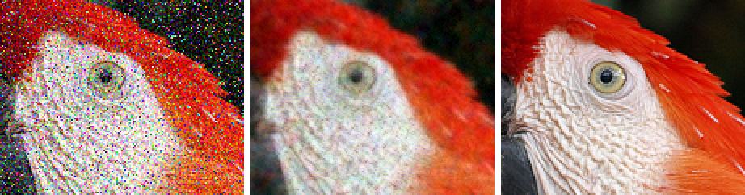
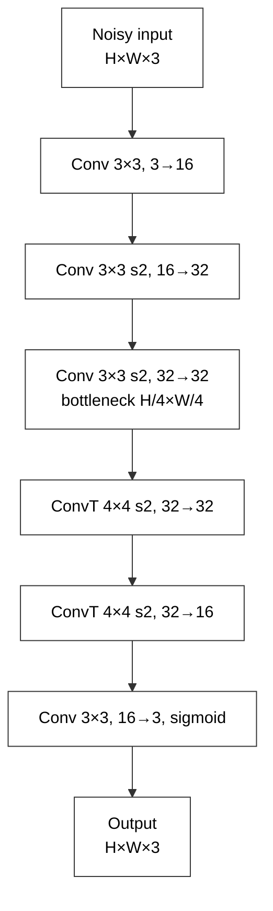
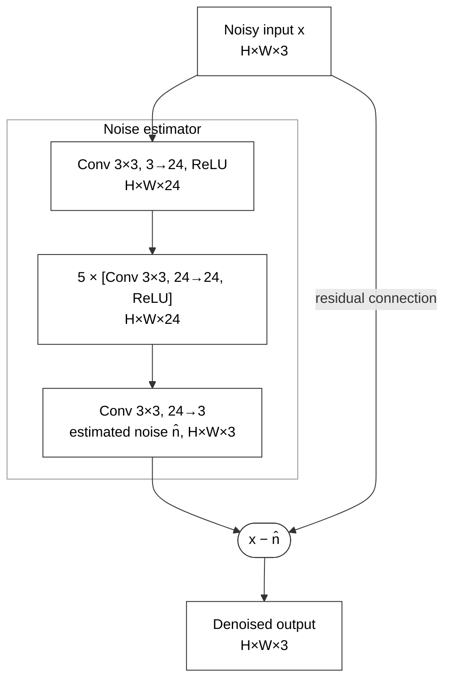

# Image Denoising with Julia and Flux.jl

**Course:** 241-353 AI Ecosystem, Prince of Songkla University (PSU)
**Session:** Workshop lecture, September 2026

This workshop introduces the Julia and Flux.jl ecosystem through a practical task: training a compact convolutional network to remove noise from images. All training data is synthesized from a single image (`image.png`), and the model trains on a laptop CPU in a few minutes.



*Left to right: noisy input (Gaussian σ = 0.15 with 10 % impulse noise), network output, clean reference.*

## Overview

**Objective.** Show a complete deep-learning workflow in Julia: data synthesis, model definition, automatic differentiation, training, persistence and inference.

**Audience.** Students with basic programming experience and an introductory knowledge of neural networks. No prior Julia experience is required.

**Learning outcomes.** Participants will be able to:
- represent images as `Float32` WHCN tensors and synthesize training pairs
- define convolutional networks with `Chain`, `Conv`, `ConvTranspose` and `SkipConnection`
- compute gradients with Zygote and train with `Flux.setup` and `Flux.update!`
- save and restore models with `Flux.state` and `Flux.loadmodel!`
- run memory-bounded inference on images of any size and evaluate it quantitatively

| Session | Notebook | Duration |
|---|---|---|
| 1. Julia and Flux essentials | [01_julia_flux_basics.ipynb](01_julia_flux_basics.ipynb) | 45 min |
| 2. Data synthesis and model design | [02_denoise_training.ipynb](02_denoise_training.ipynb), sections 1–3 | 45 min |
| 3. Training and evaluation | [02_denoise_training.ipynb](02_denoise_training.ipynb), sections 4–6 | 40 min |
| 4. Inference and limitations | [03_denoise_inference.ipynb](03_denoise_inference.ipynb) | 40 min |
| Discussion and exercises | – | 10 min |

Run the notebooks in order. Notebook 3 loads `denoiser.jld2`, which notebook 2 writes.

## Setup

Requirements: Julia 1.13, Jupyter with IJulia (or VS Code with the Jupyter extension), and about 2 GB of free RAM. No GPU is needed.

```bash
git clone https://github.com/rwttr/Eco-workshop-n8.git
cd Eco-workshop-n8
julia --project=. -e 'using Pkg; Pkg.instantiate()'
julia --project=. -e 'using IJulia; IJulia.installkernel("Julia", "--project=@.")'
```

For faster training, register a multithreaded kernel with `IJulia.installkernel("Julia (threads)", "--project=@."; env = Dict("JULIA_NUM_THREADS" => "auto"))`.

**Main packages:**
- **Flux.jl:** layers, optimisers, `DataLoader`
- **Zygote.jl:** automatic differentiation
- **Enzyme.jl:** alternative AD backend, compared in notebook 1
- **Images.jl / FileIO.jl:** image I/O and classical filters
- **JLD2.jl:** model persistence
- **Plots.jl:** plots

Zygote is the default AD backend here. It handles standard Flux layers well and compiles much faster than Enzyme on a CPU.

## Method

- **Data:** random 40×40 patches from `image.png` at scales 1/4, 1/3 and 1/2, with random flips and transposes. The bottom 20 % of the image is held out for validation.
- **Noise:** Gaussian white noise with σ ~ U[0.05, 0.35]. Half of the patches also receive random-valued impulse noise (p ~ U[0, 0.20]). New noise is drawn every epoch.
- **Training:** MSE loss and Adam (learning rate 2e-3, divided by 5 for the final quarter of training), for 20 epochs of 1,024 patches with batch size 32.
- **Inference:** a single forward pass for any image size. Large images are processed as 256×256 tiles with a 16-pixel margin, which gives output identical to a single pass.

## Models

Two models are compared: a baseline encoder–decoder and the proposed residual CNN.

### Baseline: convolutional autoencoder



| # | Layer | Kernel / stride | Channels | Output | Parameters |
|---|---|---|---|---|---|
| 1 | Conv + ReLU | 3×3 / 1 | 3 → 16 | H×W×16 | 448 |
| 2 | Conv + ReLU | 3×3 / 2 | 16 → 32 | H/2×W/2×32 | 4,640 |
| 3 | Conv + ReLU (bottleneck) | 3×3 / 2 | 32 → 32 | H/4×W/4×32 | 9,248 |
| 4 | ConvTranspose + ReLU | 4×4 / 2 | 32 → 32 | H/2×W/2×32 | 16,416 |
| 5 | ConvTranspose + ReLU | 4×4 / 2 | 32 → 16 | H×W×16 | 8,208 |
| 6 | Conv + sigmoid | 3×3 / 1 | 16 → 3 | H×W×3 | 435 |
| | **Total** | | | | **39,395** |

The bottleneck suppresses noise but also discards fine detail, so the output is blurred.

### Proposed: residual CNN (DnCNN-style)



| # | Layer | Kernel / stride | Channels | Output | Receptive field | Parameters |
|---|---|---|---|---|---|---|
| 1 | Conv + ReLU | 3×3 / 1 | 3 → 24 | H×W×24 | 3×3 | 672 |
| 2–6 | Conv + ReLU (×5) | 3×3 / 1 | 24 → 24 | H×W×24 | 5×5 → 13×13 | 5 × 5,208 |
| 7 | Conv (noise estimate) | 3×3 / 1 | 24 → 3 | H×W×3 | 15×15 | 651 |
| 8 | Residual: `x − n̂` | – | 3 | H×W×3 | 15×15 | 0 |
| | **Total** | | | | | **27,363** (107 KiB) |

In Flux: `SkipConnection(Chain(...), subtract_noise)`. The network has no downsampling, so it keeps full resolution and accepts any input size. It estimates the noise rather than the clean image (residual learning), which trains faster and preserves detail.

## Evaluation

**Metrics.** Both metrics are computed over all pixels and channels, with intensities in [0, 1].
- **MSE** is the training loss:

  $$\mathrm{MSE} = \tfrac{1}{N}\sum_i (\hat{x}_i - x_i)^2$$

  Its square root (RMSE) is the typical per-pixel error; for example, 0.05 corresponds to about 13 levels on the 8-bit scale.
- **PSNR** is the reported metric, in dB; higher is better:

  $$\mathrm{PSNR} = 10\log_{10}(1/\mathrm{MSE})$$

  It is logarithmic: +3 dB halves the MSE and +10 dB reduces it tenfold. For Gaussian noise, the noisy input scores about −20·log₁₀σ (20 dB at σ = 0.1). As a rough guide, values below 20 dB indicate strong degradation, 25–30 dB good quality, and above 30 dB differences that are hard to see.
- **Limitation:** PSNR is a pixel-wise measure and does not fully capture perceived structure. It tends to favour slightly smooth outputs. SSIM (`assess_ssim` in Images.jl) is a common complement, and the notebooks show zoomed crops alongside all numbers.

**Protocol.**
- **Validation:** 128 fixed 48×48 patches from the held-out region, with mixed noise (σ = 0.15, p = 0.10) and fixed seeds.
- **Test:** the image at 1/2 scale (539×600) and at full resolution (1078×1200), with sweeps over Gaussian σ and impulse p, including levels beyond the training range.
- **Baselines:** the noisy input, a Gaussian blur and a median filter. Each filter uses the setting with the highest PSNR, so its score is an upper bound for that filter.
- **Generalisation:** row-stripe noise, a spatially correlated noise type absent from training.

## Results

Measured on an Apple Silicon laptop (CPU, one thread, default settings). Values vary slightly between runs.

**Training** (validation PSNR, σ = 0.15 with p = 0.10):

| Model | Parameters | Training time | PSNR |
|---|---|---|---|
| Noisy input | – | – | 14.4 dB |
| Baseline autoencoder | 39,395 | 58 s | 22.5 dB |
| Residual CNN | 27,363 | 169 s | **24.7 dB** |

**Inference** on the half-resolution test image, which takes 0.4 s per image:

| Noise | Noisy input | Best blur | Best median | Residual CNN |
|---|---|---|---|---|
| σ = 0.15, p = 0.10 (demo) | 14.3 dB | 21.7 dB | 24.9 dB | **26.4 dB** |
| Gaussian σ = 0.10 | 21.3 dB | 27.8 dB | 27.4 dB | **28.8 dB** |
| Gaussian σ = 0.30 | 12.8 dB | 20.4 dB | 22.4 dB | **25.0 dB** |
| Gaussian σ = 0.50 (beyond training range) | 9.4 dB | 16.1 dB | 19.0 dB | **22.1 dB** |
| Impulse p = 0.10 | 16.3 dB | 24.4 dB | **31.3 dB** | 27.7 dB |
| Impulse p = 0.30 (beyond training range) | 11.5 dB | 17.8 dB | **27.7 dB** | 23.8 dB |

- **Full resolution (1078×1200, tiled):** mixed noise improves from 14.3 dB to 27.1 dB in 3.0 s.
- **Where the network leads:** Gaussian and mixed noise, with the margin widening as the noise level rises.
- **Where the median filter leads:** pure impulse noise, for which it is designed.
- **Unseen noise:** on row-stripe noise, PSNR rises from 21.6 dB to 25.4 dB, but banding remains visible. This shows that the model generalises only within its training distribution.

## Repository layout

```
.
├── 01_julia_flux_basics.ipynb    # Julia and Flux essentials
├── 02_denoise_training.ipynb     # data synthesis, models, training
├── 03_denoise_inference.ipynb    # inference, evaluation, limitations
├── image.png                     # demo image (1200×1078)
├── noisy_full.png                # full-resolution noisy input (notebook 3)
├── denoised_full.png             # full-resolution denoised output (notebook 3)
├── assets/                       # README figures
├── Project.toml, Manifest.toml   # Julia environment
└── .vscode/settings.json         # notebook markdown font size
```

The trained weights (`denoiser.jld2`) are produced by notebook 2 and are not tracked.
